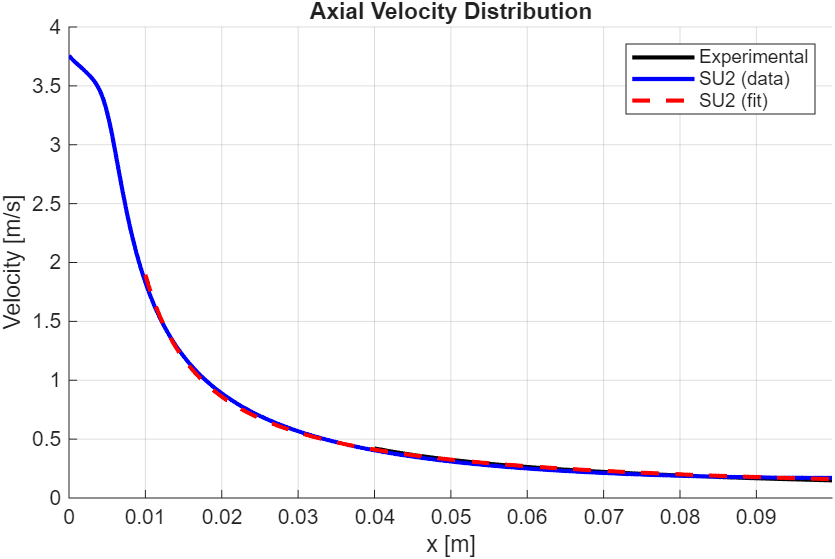
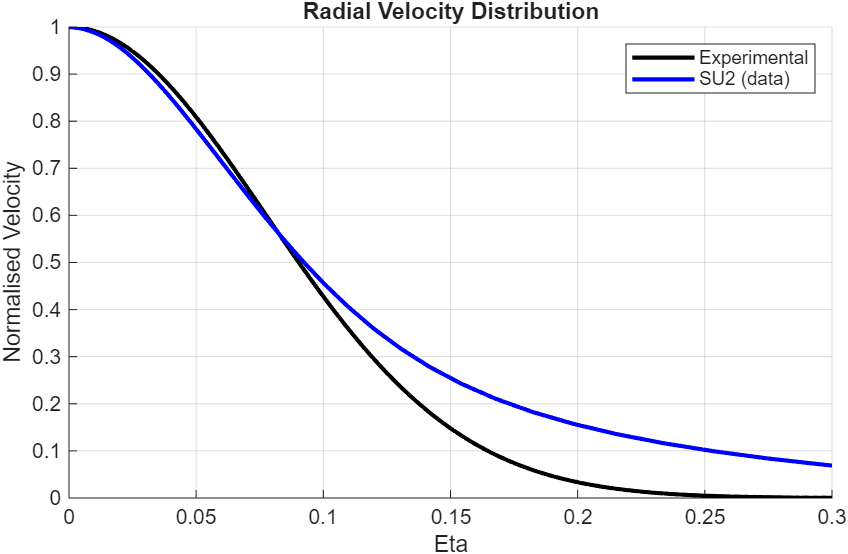
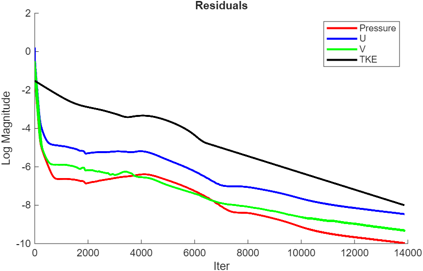

# Assignment 2: Steady, Axisymmetric Turbulent Jet

 

## Motivation
The turbulent jet is a classic benchmark for the implementation of turbulent solvers. Its significance lies in its unique combination of strong shear layers, high velocity gradients, and the transition from a laminar core to fully developed turbulence. This test case provides clear, comparable metrics for assessing a solver's ability to model turbulent dispertion, through axial velocity distributions that are reciprocal along the centreline (x axis) and Gaussian in the radial direction (y axis). It is also backed by decades of high-fidelity experimental data and simulation results, remaining an essential sanity check for validating whether a solver can capture turblent mixing in real-world engineering applications.

 

## Mesh
The mesh was created in gmsh by scripting a .geo file (see repo) and converting to .su2 using the command

    gmsh -2 jet_pipe_coarse.geo -format su2 -o jet_pipe_coarse.su2

A rectangular, axisymmetric mesh was used to capture the full, 360-degree physics of the jet while saving on compute, only having to compute a 2D section instead of an entire 3D domain. Whilst an expanding, trapezoidal flow domain would futher save comptue with less redundant cells in the corner of the domain above the jet inlet, a rectangular channel was used for ease of .geo scripting and adjusting of the mesh. 

The mesh contained 4 regions, where d is the diameter of the jet inlet nozzle:

| Region | Length in x [m] | Length in y [m]
|---|---|---|
| Total | 130d | 40d |
| Pipeflow | 30d | 0.5d |
| Jet | 100d | 0.5d |
| Above pipe | 30d | 39.5d |
| Above jet | 100d | 39.5d |

A pipe was implemented in the form of a no-slip wall above the jet to develop a turbulent pipe flow velocity profile at the start of the expanding region.

Multiple runs were performed on an increasingly fine mesh to confirm independance of results on the mesh. The parameters of the final mesh are shown below:

| Parameter | Quantity
|---|---|
| No. Nodes | 11635 |
| No. Elements | 11392 |
| Element Type | Quadrilateral |

 

## Configuration Options

### Fluid Properties
The fluid was modelled using CONSTANT_DENSITY and CONSTANT_VISCOSITY (water at low speed is incompressible; no heat transfer). Values were not stated in the study and thus assumed to be sea level atmospheric:
- Density = 998.2 [kg/m^3]
- Dynamic viscosity = 1.0E-3 [Pa s]

 

### Flow Conditions and Nozzle
Flow conditions and nozzle parameters were taken from experimental data [1]; otherwise assumed atmospheric at sea level:
- Temperature = 293 [K]
- Nozzle diameter d = 1 [mm]

Inlet conditions are as follows:
Jet inlet:
- Velocity = 4.17 [m/s]
- Turbulence intensity = 4%
- Eddy viscosity ratio = 5

Coflow inlet:
- Velocity = 0.0 [m/s]
- Turbulence intensity = 0.4%
- Eddy viscosity ratio = 1

Originally, using a coflow velocity = 0 (as in the experiment) caused instant NaN's. However, setting the initial velocicty field near the jet velocity and choosing a larger value CFL number fixed this. The coflow inlet boundary condition was kept to enable experimentation during simulations.

Additionally, the paper suggests Re=2000 (and thus a velocity = 2.0 [m/s]) at the inlet. However, this produced extremely poor results for both the 1/x decay of axial velocity and radial velocity profile, and is empirically far below turbulent flow. As neither the inlet velocity nor data in within the first 40d downstream of the nozzle was provided, inlet velocity was treated as an unknown. A parameter sweep was therefore conducted until a realistic result was achieved at an inlet velocity of 4.17 [m/s].

 

### Numerical Models
INC_RANS with SST was used as it is the typical solver of choice for this problem, sporting a good balance between shear layer / expansion accuracy and compute. NUM_METHOD_GRAD= WEIGHTED_LEAST_SQUARES was used to ensure accuracy on the non-uniform grid, which LEAST_SQUARES can struggle with.

For the turbulent method, 1st-order CONV_NUM_METHOD_TURB= SCALAR_UPWIND was used to ensure stability - the limiting factor of this problem, with the simulation taking over 10000 iterations to converge. This is due to the fact that SU2 uses artificial compressibility methods instead of a pressure-based solver for incompressible flows, which can lead to stability issues.

CFL = 200 with CFL_REDUCTION_TURB= 0.5 was used to converge as quickly as possible to the solution without overshooting and diverging.

Linear solver options:
- LINEAR_SOLVER= FGMRES
- LINEAR_SOLVER_PREC= ILU
- LINEAR_SOLVER_ERROR= 1E-5
- LINEAR_SOLVER_ITER= 5

5 iterations with a moderate tolerance was chosen as a compromise between the stability offered by the linear solver for this highly stiff problem and computational speed.

 

### Stability
The following convergence parameters were used:
- CONV_FIELD= RMS_PRESSURE, RMS_VELOCITY-X, RMS_VELOCITY-Y, RMS_TKE
- CONV_RESIDUAL_MINVAL= -8.0
RMS_TKE was included to monitor the turbulence model, as the correct functional forms for U_axial, U_radial can be achieved with the other 3 residuals converged, even if a poor turbulence model drives incorrect fitting parameters.

 

## Results

The axial velocity distribution followed the theoretical asymptotic behaviour and showed good agreement with experimental data from [1]. 

 

The radial distribution of axial velocity produced poorer results. This may be due to overestimated turbulence parameters, causing the jet to expand faster than it would otherwise. This modelling error would also explain why an inlet velocity corresponding to double the Re number used in the experiment was required to reproduce the same results for the variation of axial velocity with x.

 

Residuals were seen to converge satisfactorily to a tolerance of 10^-8, although in a large number of iterations as explained above.

 

## References
[1] https://www.researchgate.net/publication/254224677_Investigation_of_the_Mixing_Process_in_an_Axisymmetric_Turbulent_Jet_Using_PIV_and_LIF
