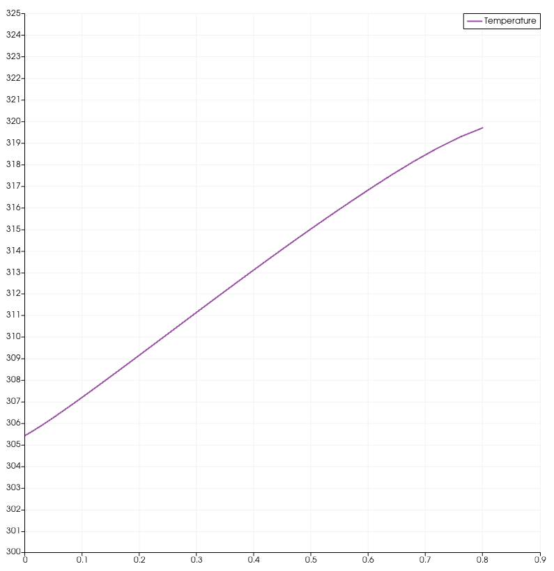

# Assignment 4: Spatially Varying Wall Temperature for a Steady-State Compressible Turbulent Flat Plate Testcase
## Setup
The same test case in Assignment 3 was used, including .cfg and .su2 files.

To enable the spatially varying wall temperature, the following area of the Python wrapper dealing directly with vertices was identified:
'''
# Set this temperature to all the vertices on the specified CHT marker
    for iVertex in range(nVertex_CHTMarker):
      SU2Driver.SetMarkerCustomTemperature(CHTMarkerID, iVertex, WallTemp)

This was modified to be:
'''
# Set this temperature to all the vertices on the specified CHT marker
# Define the base wall temperature (user defined)
    # Getting coordinates
    coords = SU2Driver.MarkerCoordinates(CHTMarkerID)

    # Set this temperature to all the vertices on the specified CHT marker
    for iVertex in range(nVertex_CHTMarker):

      # Assignment 4: Spatially-Varying Wall Temperature
      x = coords(iVertex, 0)
      SpatialWallTemp = WallTemp + (x * 200)

      SU2Driver.SetMarkerCustomTemperature(CHTMarkerID, iVertex, SpatialWallTemp)
with the previous time-varying function for WallTemp set to a constant, reflecting the steady nature of this simulation. The expected result was a linear increase in temperature across the plate.

## Results
The simulated plate temperature distribution is displayed below:

The match of the functional form with the implemented analytical expression confirms the correct implementation of this feature.
