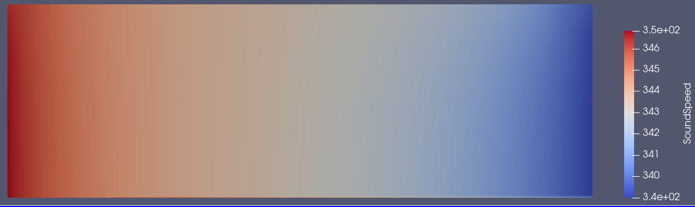

# Assignment 5: Addition of Speed of Sound Volume Output

## Implementation
Speed of sound is already calculated in the compressible solvers as SoundSpeed. Therefore, all that is required is to add extra lines to write the variable to the volume, history and screen outputs - no calculations are necessary.

First, history output was implemented. The CFlowOutput.cpp file was changed to add speed of sound by adding the line:
AddHistoryOutput("SURFACE_SOUND_SPEED", "Avg_SoundSpeed",  ScreenOutputFormat::SCIENTIFIC, "FLOW_COEFF", "Total average speed of sound on all markers set in MARKER_ANALYZE", HistoryFieldType::COEFFICIENT);
to CFlowOutput.cpp.

Next, Mach number is only defined in the output within the CFlowCompOutput.cpp file. Speed of sound was therefore implemented here, using the lines:

    AddVolumeOutput("SOUNDSPEED", "SoundSpeed",               "PRIMITIVE", "Speed of Sound");
within SetVolumeOutputFields(), and

    SetVolumeOutputValue("SOUNDSPEED", iPoint, Node_Flow->GetSoundSpeed(iPoint));
within LoadVolumeData().

Finally, the output window was targeted. As SOUNDSPEED is a Primitive variable, no additional changes were needed to get it to display.

The new build was created and installed using the commands:

    ./meson.py setup GSoC_SoundSpeed_build
    ./ninja -C GSoC_SoundSpeed_build install

## Results
As the test case in Assignment 2 was run using an incompressilbe solve to match the experimental data provided, the compressible test case from Assignment 3 was rerun. The SoundSpeed output in Paraview can be seen below:

This matches the expected distribution from the pressure and temperature fields of the flow, confirming correct implementation.
